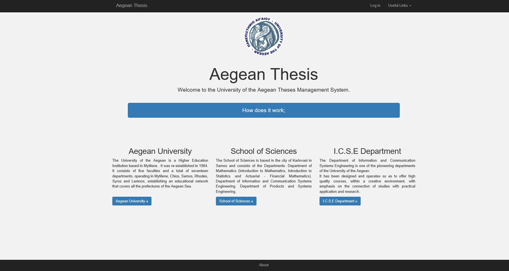

# AegeanThesis - Creating a thesis management system

As a part of my Master in Computer Science in the Department of Information & Communication Systems Engineering of the 
University of the Aegean I created  a thesis management system under the supervision of professor Manolis Maragkoudakis.

The AegeanThesis management system was created using the Yii 2.0 framework and started on November 2016.

This is my first step into the world of coding since it was the first program I've ever written with no prior programming knowledge.

The construction of the system was finished in May 2017 and presented in the supervising commitee in June 2017. 

-------------------------------------------------------------
